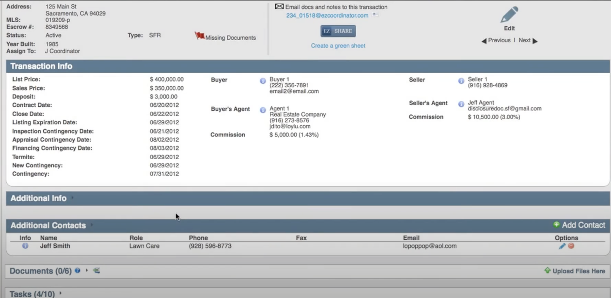

ConnectEase is a command-line interface (CLI) tool designed for real estate agents to manage leads offline with local storage. Built for simplicity and mobility, it integrates with CLI tools like email clients and calendars, offering a streamlined alternative to complex CRMs.

## Features

## Why ConnectEase Makes a Good Business
- **Market Size:** 1.5M+ agents in the U.S., many independent or in small firms, spending $500-$1,000/year on tools (NAR data). A $10/month subscription or $99 one-time fee taps this nicely.
- **Low Cost:** CLI keeps development lean—no servers, just local apps. Revenue scales via sales or premium features (e.g., multi-agent sync, analytics).
- **Competitive Edge:** Beats bloated CRMs (e.g., Top Producer, $40+/month) with simplicity and a personal touch agents crave for client rapport.
- **Growth Path:** Add features like MLS integration, team sharing, or lead scoring as upsells to grow the business.

## The Experience
Imagine you’re at an open house:
- You: “Start a thread for Mike”
  ConnectEase: “Mike’s on board! Contact info?”
  You: “mike@buyer.com, met here, wants a fixer-upper”
  ConnectEase: “Mike: Open house meet, fixer-upper fan. Tag him?"

Later, sealing the deal:
- You: “Drop a capsule for Mike”
  ConnectEase: “What’s the milestone?”
  You: “Closed today, $300K sale”
  ConnectEase: “Locked for March 19, 2025—big win, agent!”

## Final Pitch
"ConnectEase: The Real Estate Agent’s CLI Vault. Thread your clients’ deals, capsule your triumphs, and replay your hustle—offline, secure, and built to sell smarter. Forget CRM clutter—this is your deal-closing sidekick."
## Acknowledgements
This project is based on the AddressBook-Level3 project created by the [SE-EDU initiative](https://se-education.org).
